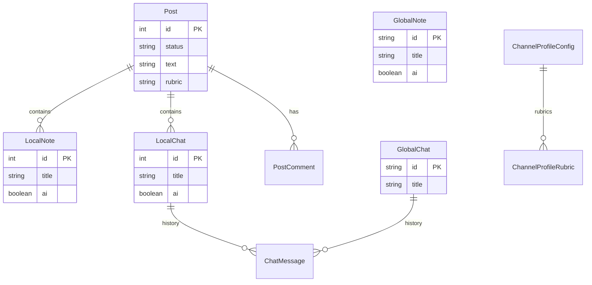
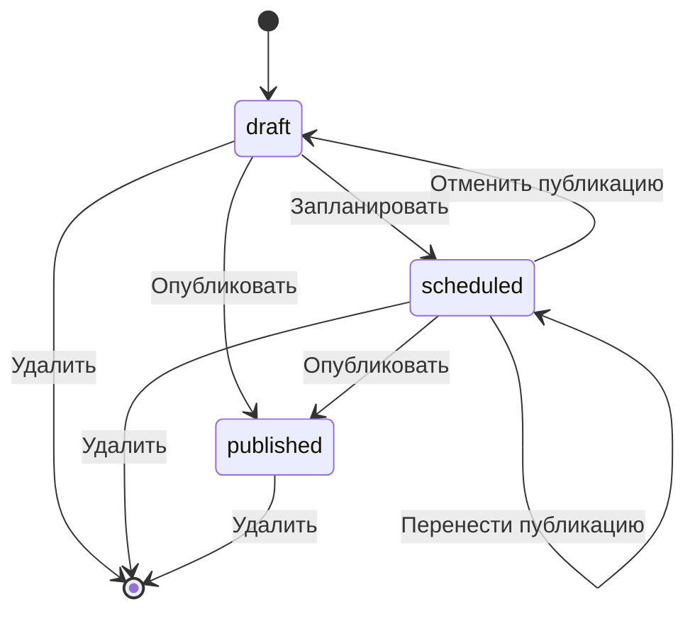

# Data model

Доменная модель web-клиента. Machine-readable source: [`web/src/shared/types/index.ts`](../../src/shared/types/index.ts), Zod — [`web/src/shared/api/schemas/`](../../src/shared/api/schemas/).

Пространственная модель продукта — [03-spaces.md](../product/03-spaces.md).

---

## Entity relationships

**Global** сущности принадлежат каналу. **Local** вложены в `Post`. Профильные конфиги — singleton на workspace.

---

## Post

| Field | Type | Notes |
|-------|------|-------|
| `id` | `number` | PK |
| `status` | `PostStatus` | `published` \| `scheduled` \| `draft` |
| `date` | `string?` | Display date (published/scheduled) |
| `created` | `string?` | Draft creation label |
| `rubric` | `string \| null` | Not shown on feed card in UI |
| `text` | `string` | Post body |
| `media` | `PostMedia[]?` | Attachments |
| `metrics` | `PostMetrics?` | Published only |
| `notes` | `LocalNote[]` | Nested local notes |
| `chats` | `LocalChat[]` | Nested local chats |
| `comments` | `PostComment[]?` | Published only |

### PostStatus state machine

Actions from post context menu — [features.md](../ux/components/features.md).

### PostMetrics

| Field | Type |
|-------|------|
| `views` | `string` |
| `reposts` | `number` |
| `reactions` | `{ emoji, count }[]` |

### PostMedia / NoteFile

| Field | Type |
|-------|------|
| `name` | `string` |
| `url` | `string` |
| `type` | `string` |
| `id` | `string?` (NoteFile only) |

---

## Notes

### GlobalNote

| Field | Type |
|-------|------|
| `id` | `string` |
| `title` | `string` |
| `date` | `string` |
| `body` | `string` |
| `ai` | `boolean` | Include in AI context |
| `files` | `NoteFile[]?` |

### LocalNote

Same as GlobalNote except `id: number`, nested under `Post.notes`.

### ActiveNote (UI/runtime)

Union for note editor:

- Global: `GlobalNote & { isGlobal: true; files; isNew? }`
- Local: `LocalNote & { isGlobal: false; postId; files; isNew? }`

---

## Chats

### GlobalChat

| Field | Type |
|-------|------|
| `id` | `string` |
| `kind` | `default` \| `omnichannel`? |
| `title` | `string` |
| `preview` | `string` |
| `date` | `string` |
| `history` | `ChatMessage[]` |

Omnichannel chat cannot be deleted (UI).

### LocalChat

| Field | Type |
|-------|------|
| `id` | `number` |
| `title` | `string` |
| `preview` | `string` |
| `date` | `string` |
| `history` | `ChatMessage[]` |
| `ai` | `boolean` | Include in post AI context |

---

## ChatMessage

| Field | Type | Notes |
|-------|------|-------|
| `role` | `user` \| `ai` | |
| `text` | `string?` | Ignored if `userBranches` set |
| `userBranches` | `UserMessageBranch[]?` | Edit branches |
| `activeUserBranch` | `number?` | |
| `variants` | `AiVariant[]?` | Multi-reply |
| `selectedVariant` | `number?` | |
| `mode` | `single` \| `multi`? | |
| `targetLabel` | `string?` | Footer labels |
| `llmLabel` | `string?` | |
| `webLabel` | `string?` | |

---

## Profile configs

### ChannelProfileConfig

| Section | Fields |
|---------|--------|
| `core` | `topic`, `audience`, `promise`, `angle`, `author` |
| `voice` | `tone`, `format`, `phrases` |
| `rules` | `must`, `avoid` |
| `rubrics` | `{ id, title, description }[]` |

UI — вкладка «Канал» в профиле. Концептуальный гайд по содержанию — [05-channel-profile.md](../product/05-channel-profile.md).

### AiProfileConfig

| Field | Type |
|-------|------|
| `llmModels` | `LlmModel[]` |
| `webSearchModels` | `LlmModel[]` |
| `orchestratorModels` | `LlmModel[]` |
| `webReasonerModels` | `LlmModel[]` |
| `ragReasonerModels` | `LlmModel[]` |
| `multiResponseEnabled` | `boolean` |
| `systemPrompt` | `string` |

### LlmModel

| Field | Type |
|-------|------|
| `id` | `string` |
| `provider` | `string` |
| `model` | `string` |
| `apiKey` | `string` |
| `active` | `boolean` |
| `includeInMulti` | `boolean` |

### TelegramProfileConfig

| Field | Type | UI visible |
|-------|------|------------|
| `authStatus` | `idle` \| `code-sent` \| `authorized` \| `connected` | partial |
| `apiId`, `apiHash`, `phone` | `string` | yes |
| `sessionName`, `syncMode` | `string` / enum | seed only, not rendered |
| `channel`, `channelTitle`, `channelStatus` | | yes |
| `lastSync`, `importedPosts` | | yes |
| `botApiToken`, `botStatus`, … | | omnichannel block |

---

## UI enums (not persisted as entities)

| Type | Values | Usage |
|------|--------|-------|
| `ScreenId` | `home`, `gchat`, `feed`, `post`, `note`, `chats`, `notes`, `analytics`, `profile` | Routing |
| `PostMode` | `chat`, `chats`, `notes`, `comments` | Post workspace (Zustand) |
| `ComposerScope` | `home`, `gchat`, `post` | Composer attach rules |
| `ChatsTab` | `all`, `global`, `local` | Chats catalog filter |
| `NoteScope` | `all`, `global`, `local` | Notes catalog filter |
| `NoteListFilter` | `all`, `ai`, `noai` | AI context filter |
| `NoteMode` | `view`, `edit` | Note editor |
| `ThemeMode` | `light`, `system`, `dark` | Theme |
| `FeedCardWidth` | `500`, `390`, `270` | Feed preview width |

---

## AI context flags

| Entity | Flag | Effect |
|--------|------|--------|
| `GlobalNote.ai` | boolean | Global AI sees note in channel context |
| `LocalNote.ai` | boolean | Post AI sees note in post context |
| `LocalChat.ai` | boolean | Post AI includes chat history |

Global notes with `ai: true` + channel profile feed global and local AI context — [04-ai-system.md](../product/04-ai-system.md).

---

## Persistence matrix

| Data | Phase 1 (local-first) | Phase 2 (backend) |
|------|----------------------|-------------------|
| Posts, notes, chats | In-memory (MSW / seed) | REST API |
| Profile configs | In-memory | REST `/profile/*` |
| Theme | `localStorage` | `localStorage` |
| Sidebar collapsed | `localStorage` (`tg-platform-sidebar-collapsed`) | same |
| Feed card width | Zustand / session | TBD |
| Post navigation mode/stack | Zustand | URL or server state TBD |
| Draft order (feed DnD) | In-memory until reload | persisted |

Details — [local-first.md](./local-first.md).

---

## Zod schemas

| Schema | File | Entity |
|--------|------|--------|
| `postSchema` | `schemas/post.ts` | Post (+ nested) |
| `globalChatSchema` | `schemas/chat.ts` | GlobalChat |
| `globalNoteSchema` | `schemas/note.ts` | GlobalNote |

API contract — [API_CONTRACT.yaml](./API_CONTRACT.yaml), [api-schemas.md](./api-schemas.md).

---

## Related

- [routing.md](./routing.md) — URL ↔ entities
- [data-model source](../../src/shared/types/index.ts)
- [seed inventory](./local-first.md#seed-inventory)
