# Navigation flows

Сквозные сценарии навигации в reference UI. Экраны — [pages.md](./pages.md). Маршруты — [routing.md](../engineering/routing.md).

Не путать с продуктовым сценарием [09-user-scenario.md](../product/09-user-scenario.md) (backend, real LLM).

---

## 1. Home → new global chat

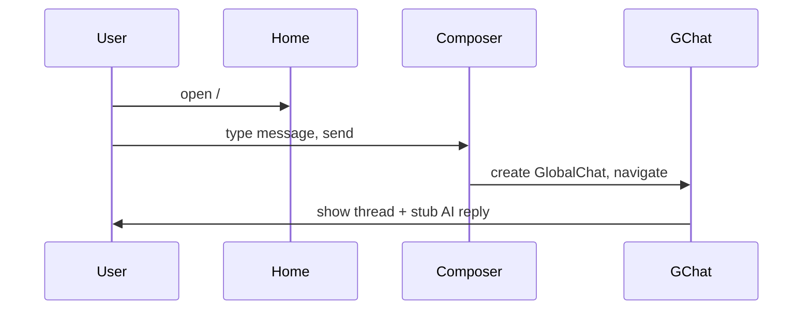

Ref: [pages.md § home](./pages.md#1-home), [pages.md § gchat](./pages.md#2-gchat)

---

## 2. Sidebar → feed → post

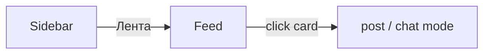

Ref: [02-feed wireframe](./wireframes/02-feed.md), [03-post wireframe](./wireframes/03-post.md)

---

## 3. Post header tabs (toggle)

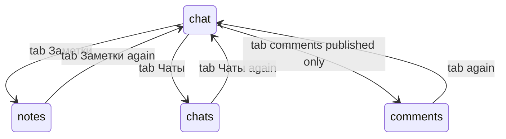

Modes in Zustand, not URL. Ref: [routing.md](../engineering/routing.md#post-navigation-zustand)

---

## 4. Post context menu by status

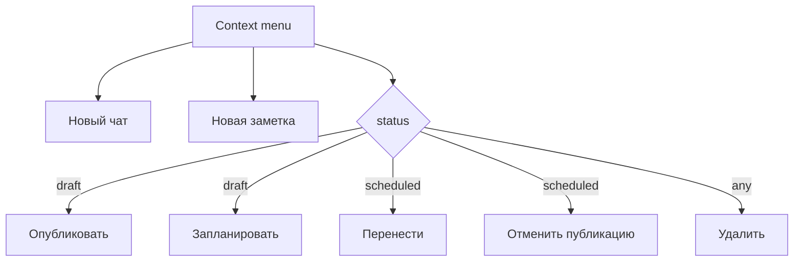

Ref: [features.md](./components/features.md#post-context-menu)

---

## 5. Feed draft DnD reorder

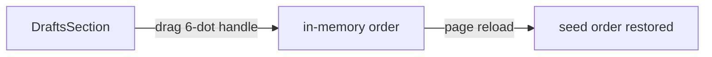

Ref: [widgets/feed.md](./components/widgets/feed.md)

---

## 6. Sidebar recent → note

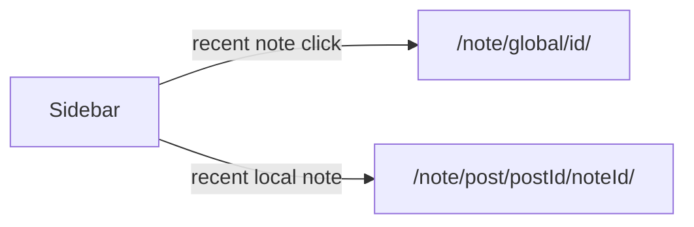

Ref: [pages.md § sidebar](./pages.md#навигация-левая-панель)

---

## 7. Sidebar recent → chat

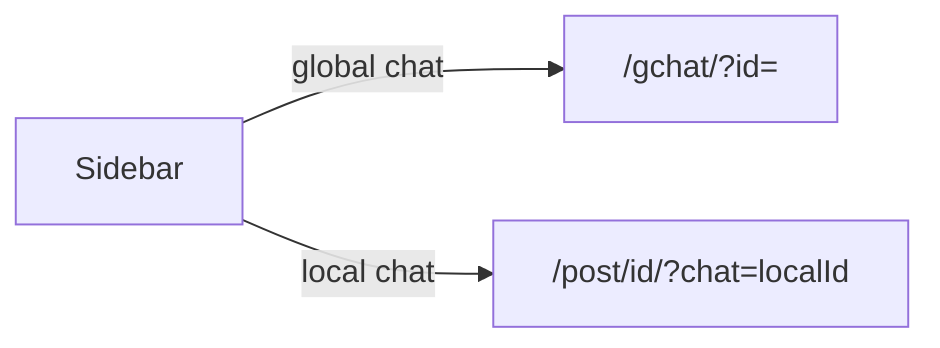

---

## 8. Chats catalog

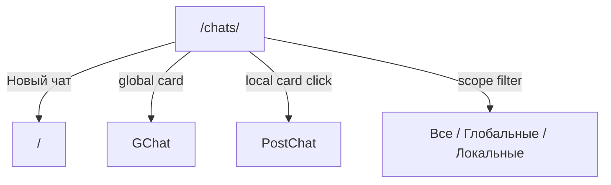

Ref: [06-chats wireframe](./wireframes/06-chats.md)

---

## 9. Notes catalog → new note

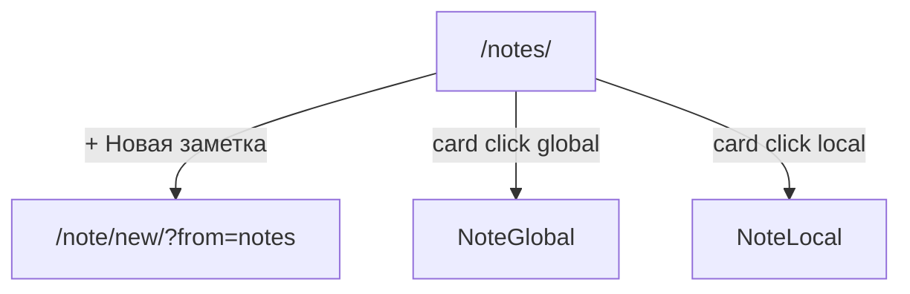

Ref: [07-notes wireframe](./wireframes/07-notes.md)

---

## 10. Note editor dirty guard

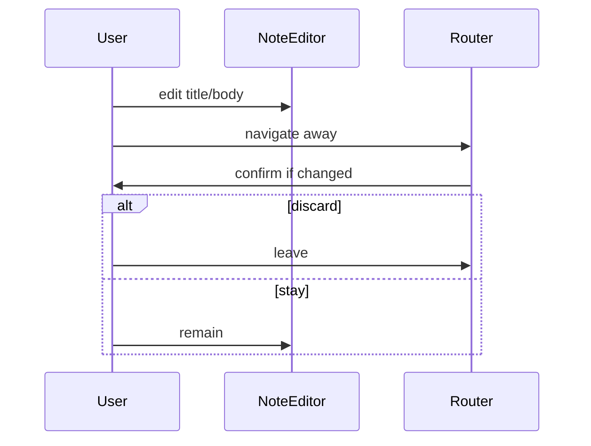

Ref: [screens.md](./components/screens.md#dirty-guards)

---

## 11. Profile tab dirty guard

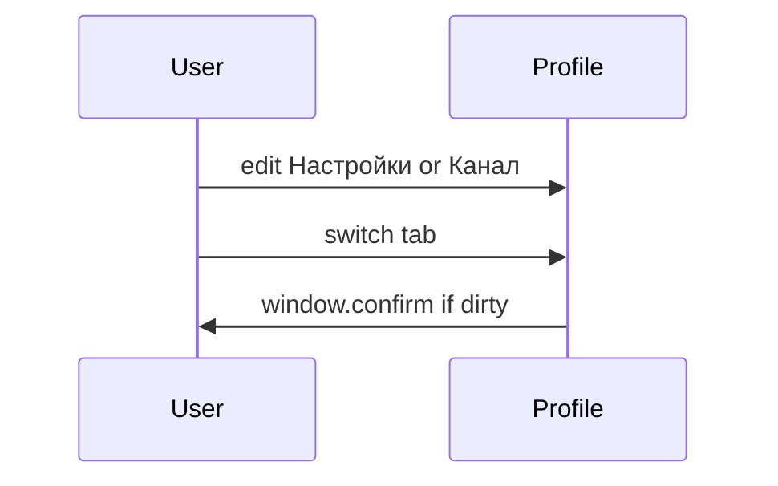

Start tab: **Настройки**. Ref: [09-profile wireframe](./wireframes/09-profile.md)

---

## 12. Analytics period filter

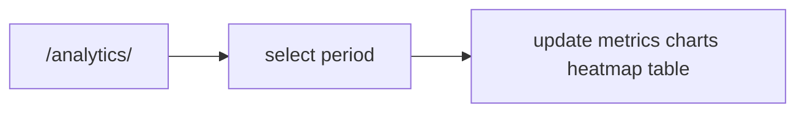

Periods: 24ч, 7д, 30д, 90д, всё время. Mobile: period in header. Ref: [08-analytics wireframe](./wireframes/08-analytics.md)

---

## Related

- [pages.md](./pages.md)
- [parity.md](./parity.md)
- [web-client.md](../engineering/web-client.md)
